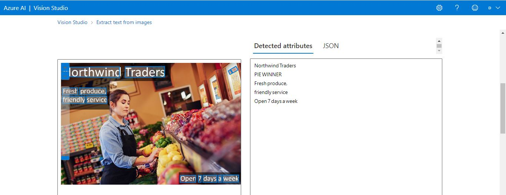
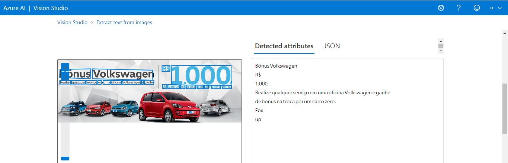

# Reconhecimento-e-Transformação-de-Imagens-AzureML

Neste README explicarei um caso de uso da Ferramenta de reconhecimento de texto dentro da Plataforma de Visão Computacional do "Microsoft Azure Machine Learning".

## Criando um Recurso

Primeiramente foi criado um novo recurso dentro do Portal "Microsoft Azure" para utiliação dos "Serviços de IA".

## Abrindo Azure Vision Studio

Após recurso criado, é necessário abrir o [MIcrosoft Azure Vision Studio](https://portal.vision.cognitive.azure.com/gallery/featured) e selecionar o recurso criado.

## Selecionando Ferramenta e Realizando Testes

### Ferramenta

Para o desafio de aprendizagem foi escolhida a ferramenta "Optical character recognition" para o reconhecimento de textos.

### Fonte de Fotos

[Imagens](https://aka.ms/mslearn-ocr-images)

### Passos

Com a ferramenta escolhida e as imagens baixadas é só realizar uma busca do arquivo de imagem e carregá-la, que a ferramenta fará todo o trabalho de reconhecimento de texto, conforme imagens 1 e 2 abaixo e também os códigos em "C#" que estão na pasta "Output".

Imagem 1

Imagem 2

## Insights

Este serviço de AI do "Azure ML" para idetificação de textos pode ser mutio útil para empresas identificarem fraudes através da comparação de dados com modelos pré-definidos ou de bancos de dados diferentes.

Também poderá ser usada por empresas para identificação de documentos, através da escolha de palavras chaves e buscando em seus documentos ou fotos o arquivo desejado. 

## Conclusão

Ferramenta de AI para remoção de texto é fácil de usar e os resultados foram precisos nas fotos analizadas. Devido aos ojetivo de aprendizagem não explorei a fundo esta ferramenta, mas creio que há um potencial muito grande para uso corporativo.

## Referências

- [Serviços de AI](https://azure.microsoft.com/pt-br/products/ai-services/)

## Documentação

- [ML Learn AI Fundamentals - OCR](https://microsoftlearning.github.io/mslearn-ai-fundamentals/Instructions/Labs/05-ocr.html)

## Ferramentas e Serviços

- 

- 

- 